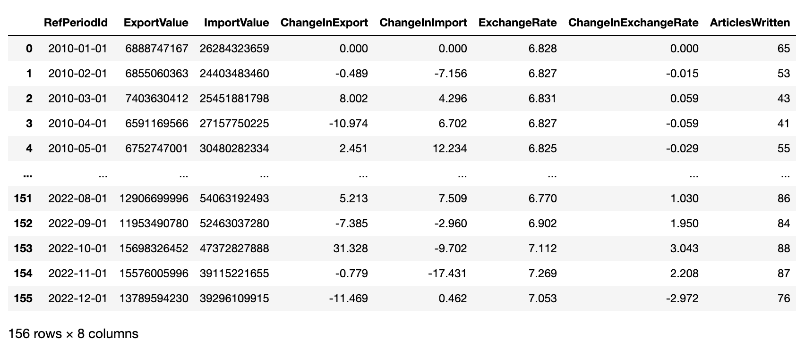
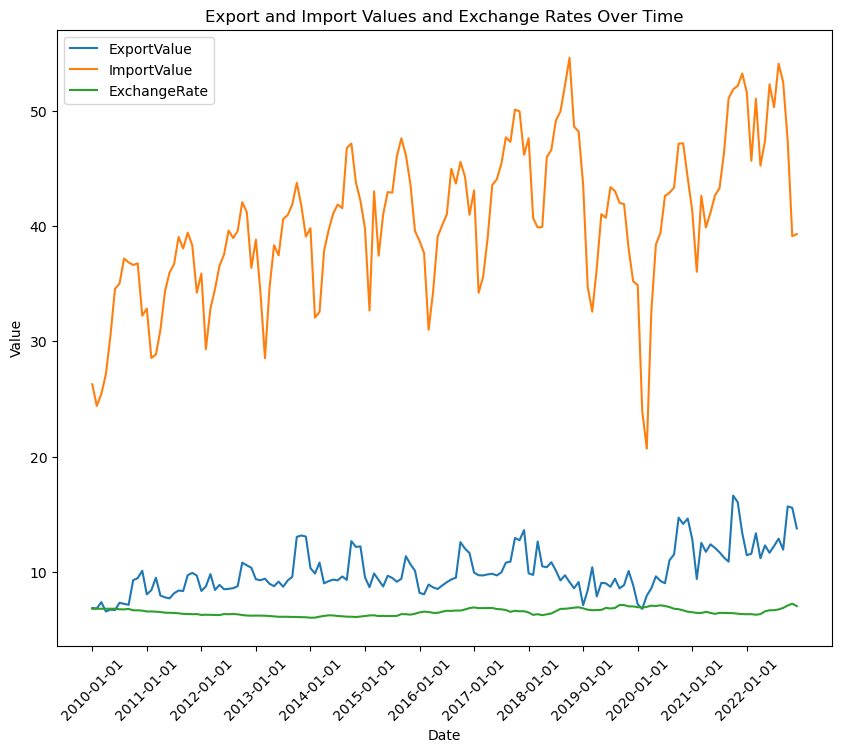
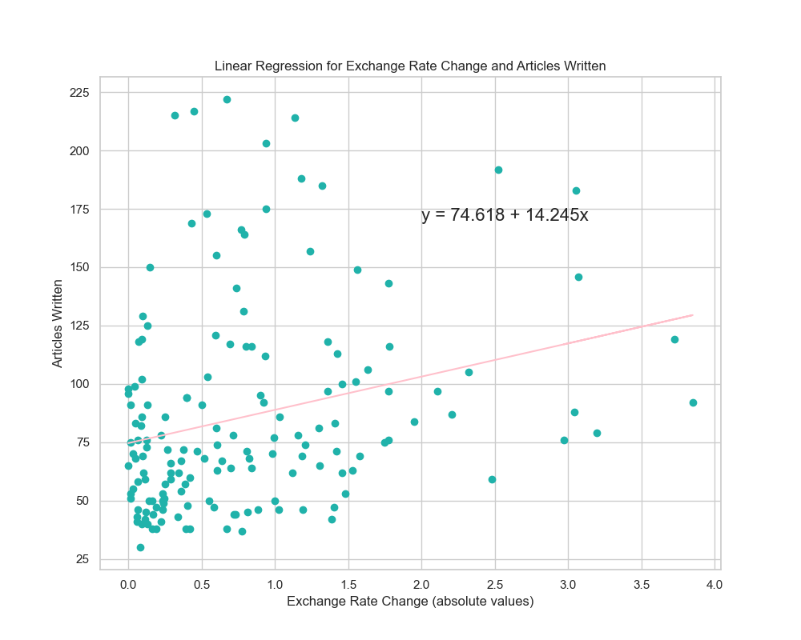
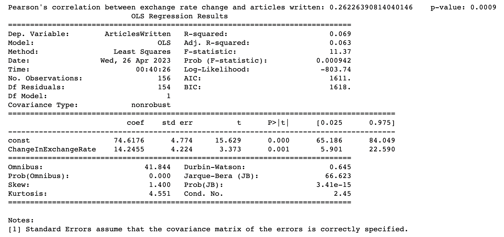
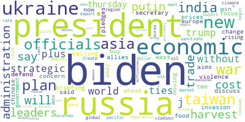

# DSCI 510 Final Project

### Description
The aim of the project is to look at the relationship between trade, exchange rate, and news coverage between the United States and China. I am concerned with how fluctuations in trade such as export and import values are correlated with fluctuations in exchange rate between the United States Dollar and Chinese Yuan. For instance, an appreciation of a currency makes exports more expensive and imports less expensive, and countries might adjust accordingly. Is this behavior observed in real life?

Additionally, fluctuations in trade and exchange rate might be indicative of activities happening between the two countries, such as growing tensions or new collaborations, which I aim to explore. To do this, I am taking the amount of news coverage provided on trade between the two countries as an indicator of the extent of conflict or interaction between them.

I generated a final dataset in the form of a csv file called "dsci_510_dataset.csv". The dataset is created by using three different data sources listed below in the Data Sources section. My starting files are within the folder "uncomtrade_datasets", and the intermediate file is "compiled_trade_data.csv". I will use the data in my intermediate file to perform web scraping and API request operations, then merge all data together for the final dataset csv file. All aforementioned files are available within the datasets directory.

### Requirements
The system must be able to run python3.

The following packages need to be installed before executing the code:
1. pandas
2. requests
3. BeautifulSoup

To install the above packages, please run the following command in the terminal:
`pip install -r requirements.txt`

The following modules must be imported before executing the code:
1. sys
2. os
3. pandas as pd
4. requests
5. BeautifulSoup
6. calendar
7. re
8. math

### Data Sources
1. [UN Comtrade Database](https://comtradeplus.un.org/)
The UN Comtrade website allows access to export and import values per month for goods between the United States and China, as reported by the United States. This allows a good look at trade between the two countries.
On a basic user account, the user is only allowed to show results for 12 months of trade data at a time, so I downloaded several separate files for export and import statistics between the years 2010-2022, with each file containing trade data for a year. These files are saved into the directory "uncomtrade_datasets", where my program will compile them into one trade dataset later on.
2. [CurrencyBeacon API](https://currencybeacon.com/api-documentation)
This is an API that returns historical exchange rates for the Chinese Yuan in reference to the United States Dollar (USD). For instance, a value of 6.5 means that 1 USD = 6.5 CNY. Using the requests library, I queried the API for the first of each month in the trade dataset and used the return JSON object to get the exchange rate. *Note: I removed my personal API key for usage limit reasons. Please register for an API key and replace it in the code if you would like the application to query the API. The code will still run without the API key via using backup data.*
3. [The New York Times](https://www.nytimes.com/)
I am performing a search on The New York Times website for relevant articles with keyword "US China Trade" within each given time period in the trade dataset. For instance, a url for August 2022 would be [https://www.nytimes.com/search?dropmab=false&endDate=20220831&query=us%20china%20trade&sort=best&startDate=20220801](https://www.nytimes.com/search?dropmab=false&endDate=20220831&query=us%20china%20trade&sort=best&startDate=20220801), which displays all articles for keyword "US China Trade" between August 1 and August 31, 2022. I am scraping the total number of articles found from the search for each month.

### Running the Code
The code can be run in three modes: default, scrape and static. It is recommended to run the code in default mode first, then either scrape mode or static mode. However, this is not necessary.

1. **Default mode**: To run the code in default mode, type command - `python3 Alison_Huang_HW4.py`
 In this mode, the program performs compiling of trade data into one trade dataset file, and then uses the monthly periods given from the trade dataset to scrape data from The New York Times and query the currency API. All the data is then merged into a single dataset. The final dataset is saved to the file "dsci_510_dataset.csv" in the same directory. The first 5 results for largest positive change in exchange rate is printed to the user. This should take around 6 minutes to run.

2. **Scrape mode**: To run the code in scrape mode, type command - `python3 Alison_Huang_HW4.py --scrape`
 In this mode, only 5 of the most recent available months are taken from the intermediate trade dataset and are used for web scraping and API request purposes. These results are generated and printed at each step, along with their size. This should take around 1 minute to run.

3. **Static mode**: To run the code in static mode, type command - `python3 Alison_Huang_HW4.py --static datasets/dsci_510_dataset.csv`
 In this mode, the code reads the "dsci_510_dataset.csv" dataset that was generated using default mode. It prints the dimensions of the whole dataset, a few descriptive statistics, as well as actual data for the 5 most recent available months. This should take around a few seconds to run.

### Analyses
Here are some analyses generated from the final dataset.
The content and dimensions of the final data.

**Some descriptive statistics:**
Mean of export value: 10.066580006410257
Mean of import value: 40.4543876474359
Mean of exchange rate: 6.548442307692308
Mean of articles written: 86.08974358974359

Visualization of export value, import value, and exchange rate from 2010-2022.

A regression analysis conducted on the relationship between exchange rate change and the number of articles written. I took the absolute value of the exchange rate change, because I am concerned with the scale of change rather than the direction of change. There is a weak positive relationship, suggesting that a larger fluctuation in the exchange rate is related to an increase in the number of articles written on trade relations between the US and China. The results are statistically significant.

I was interested in finding out what happened during months where there was a large fluctuation in exchange rate compared to the previous month. May 2022 had one of the highest increases in exchange rate. I scraped 30 of the most relevant articles on The New York Times related to US China trade in the month of May 2022, and generated a word cloud from the headline and blurb description from those articles. The word cloud provides an idea of the events that happened, which may explain the increase in exchange rate.

### Further Extensibility
The code can be extended to analyze trade between other countries or more countries. For instance, Canada and Mexico are two more of the US' top trade partners. We can conduct further analyses with more countries in order to collect more tests and see if a solid relationships can be drawn between import and export values, exchange rates, and news popularity.

Furthermore, instead of just getting the number of articles written each month with the keyword on The New York Times, we can scrape the headline and the article descriptions and conduct a sentiment analysis to analyze overall feelings about trade relations that month.

### Maintainability and Drawbacks
The currency exchange rate API that I am using is on the free plan which has a limit of 5000 requests per month. A request has to be sent for each monthly period to get information on historical requests. If the dataset grows larger or the code is executed many many times, the code will break as no more requests are allowed by the API.

The API is sometimes unresponsive. To handle it, I have a backup exchange_rate.csv file within the datasets folder, which has already been prepopulated with exchange rates from previous API calls. If the API is unresponsive, then I will use the backup file instead. However in the event this happens, please execute the code again once the API is back up to be able to see how the complete program is meant to run!

The code scrapes the number of articles from The New York Times based on the keyword "US China Trade". The keyword is relatively simple and may not grab all articles that have to do with trade relations that month, or it may grab unrelated articles. The New York Times is also only one news source out of many in the United States. Therefore, the news metrics gathered may not offer a comprehensive look at what happened that month.